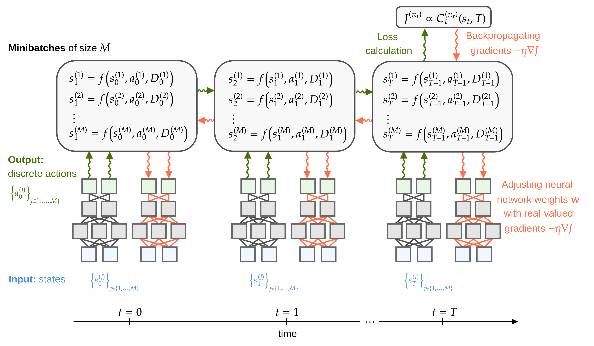

Understanding idinn
===================

Inventory Dynamics
------------------

Controllers
-----------

Loss
----

Train Neural Controllers
------------------------

Save and Load States, Transfer Learning
---------------------------------------